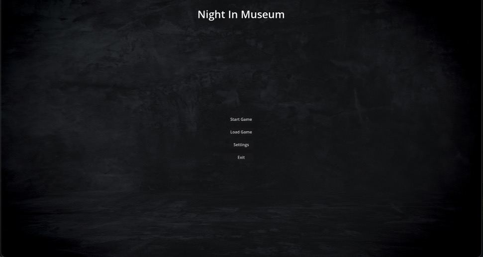
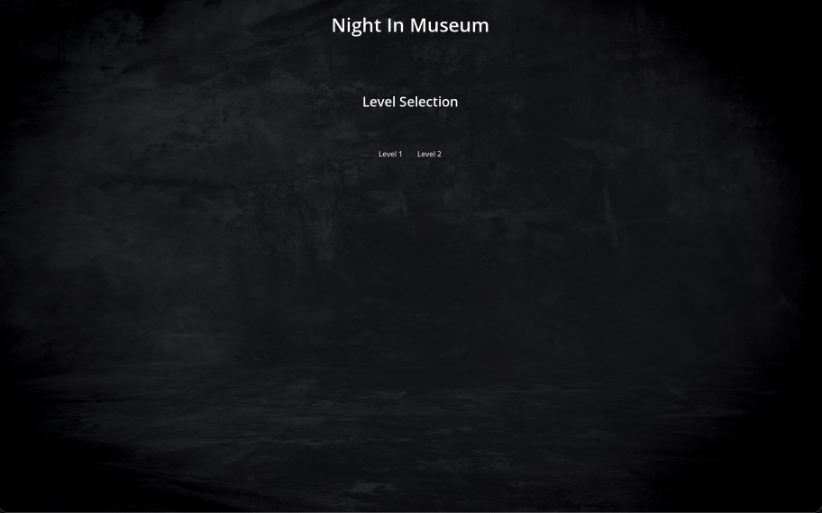
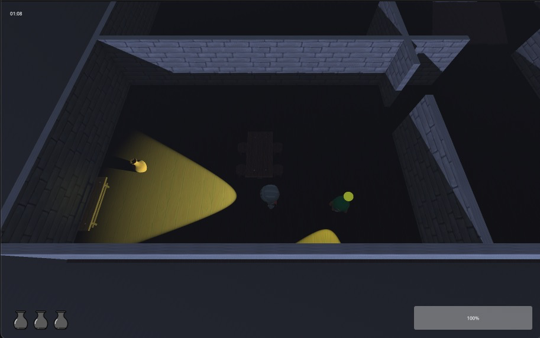
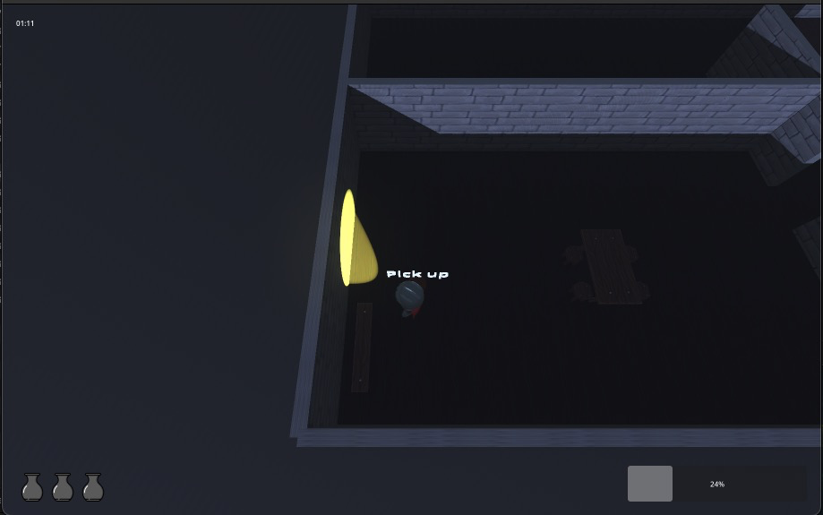
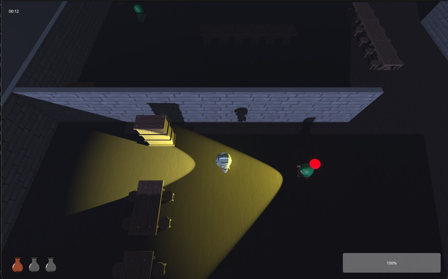
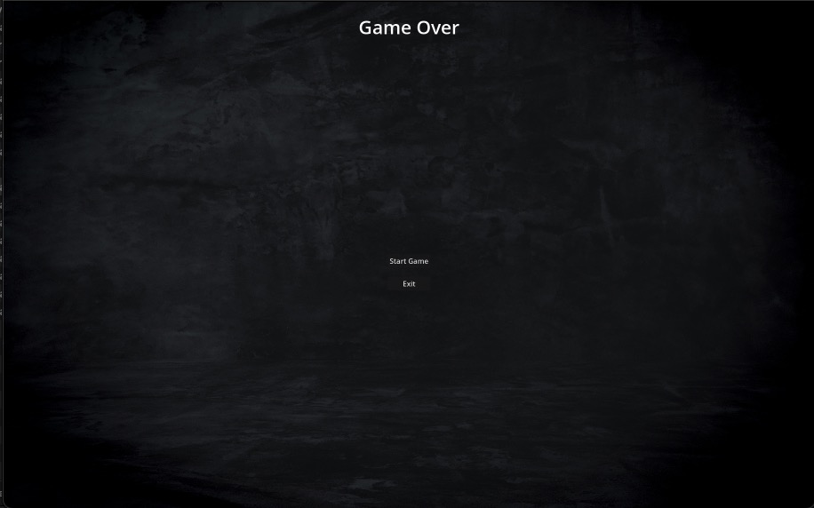

# Night in museum

## Authors:
- Michał Świstowski
- Dawid Kurdyła
  
### Technologia
Gra została stworzona na otwartoźródłowym silniku Godot w oparciu o język GDScript.

### Idea gry
Night in Museum to gra której celem jest odnalezienie wszystkich artefaktów w muzeum w ograniczonym czasie. Elementem kluczowym gry jest konieczność unikania strażników, którzy patrolują muzeum. Wykrycie przez strażnika skutkuje natychmiastową przegraną. Gracz musi zatem wykazać się zręcznością oraz umiejętnością przewidywania ruchów strażników, aby skutecznie przemieszczać się między pomieszczeniami i zdobywać kolejne artefakty. Gra toczy się w nocy, a więc widoczność jest ograniczona, dlatego zarówno gracz jak i strażnicy wyposażeni są w latarki.

*** 
### Prezentacja gry

Po uruchomieniu gry wita nas prosty ekran główny:

Nie wszystkie dostępne tu opcje zostały zaimplementowane, nie możemy załadować zapisóœ gry, oraz modyfikować ustawień. Po kliknięciu przycisku Exit wyjdziemy z gry, a po wybraniu opcji Start Game zostaniemy przeniesieni do następnego ekranu wyboru poziomu:
 

Po wybraniu poziomu przechodzimy do gry:

W lewym górnym rogu ekranu znajduje się licznik czasu jaki pozostał nam do zebrania wszystkich artefaktów, w lewym dolnym rogu znajdują się ikony reprezentujące podniesione artefakty. Po znalezieniu przedmiotu jego ikona zmienia kolor z czarno-białego na kolorowy, po znalezieniu wszystkich artefaktów poziom się kończy.

Po zbliżeniu się do artefaktu pojawia się nad nim napis “Pick up”, po wciśnięciu klawisza E możemy podnieść dany artefakt i jego ikona pojawi się w lewym dolnym rogu ekranu.

Bohater dysponuję umiejętnością sprintu. Ta jednak wyczerpuje jego kondycję. Gdy ta wyczerpie się do zera, gracz musi przeczekać cooldown trwający 5 sekund zanim bęzdie znów mógł wykońać szybki bieg.

Po wejściu przez gracza w obszar widzenia, lub nadmierne zbliżenie się do przeciwnika, ładuje się licznik wykrycia, nad przeciwnikiem pojawia się żółta sfera, która powiększa się kiedy gracz przebywa w polu widzenia przeciwnika.

Wraz z powiększaniem, sfera staje się czerwona, i po osiągnięciu pewnego rozmiaru gracz zostaje wykryty i przegrywa.

Sfera ulega pomniejszeniu po wyjściu z pola widzenia przeciwnika, jednak ten proces jest dużo wolniejszy niż jej powiększanie.

Jeśli gracz zostanie wykryty, lub nie odnajdzie wszystkich artefaktów w wyznaczonym czasie gracz przegrywa, i gra zostaje przeniesiona do ekranu końca gry.

Jeśli gracz znajdzie wszystkie wymagane przedmioty, wtedy zostanie przeniesiony do ekranu końcowego.
